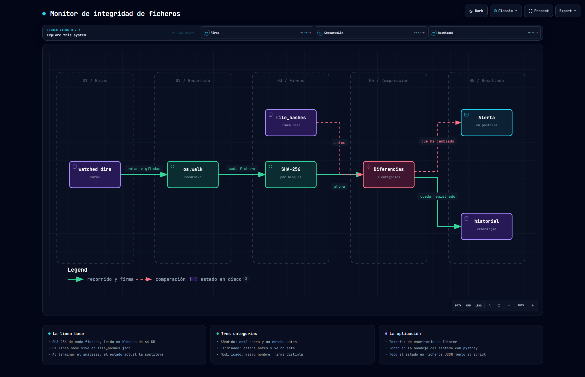

# File Integrity Monitor

Aplicación de escritorio para Windows que vigila directorios: guarda el SHA-256 de cada fichero y,
en el siguiente análisis, dice exactamente qué se ha añadido, qué ha desaparecido y qué ha
cambiado de contenido.

Python · Tkinter · hashlib · pystray



> Diagrama generado con [Archify](https://github.com/tt-a1i/archify) a partir del código de este
> repositorio. Especificación en [`docs/flujo.dataflow.json`](docs/flujo.dataflow.json);
> versión navegable en [`docs/flujo.html`](docs/flujo.html).

---

## La idea

Un fichero puede cambiar sin que cambie su fecha, su tamaño ni su nombre. Lo único que no se puede
falsear fácilmente es su contenido, y para eso está el hash: si un solo byte cambia, el SHA-256
cambia entero.

El monitor guarda una **línea base** —el hash de todo lo que hay en las rutas vigiladas— y en cada
análisis vuelve a calcularla y compara.

## La comparación

Toda la lógica de detección son tres líneas de conjuntos:

```python
added    = set(new_state) - set(self.state)
removed  = set(self.state) - set(new_state)
modified = {f for f in new_state if f in self.state and new_state[f] != self.state[f]}
```

- **Añadido**: la ruta está ahora y no estaba en la línea base
- **Eliminado**: estaba en la línea base y ya no aparece
- **Modificado**: la ruta está en las dos, pero con un hash distinto

Los dos primeros salen de restar conjuntos de claves. El tercero es el interesante: hay que
recorrer la intersección comparando valores, porque una ruta que sigue existiendo con otro
contenido no se detecta mirando solo los nombres.

## El hash

```python
def calculate_hash(filepath):
    sha256 = hashlib.sha256()
    try:
        with open(filepath, "rb") as f:
            for chunk in iter(lambda: f.read(65536), b""):
                sha256.update(chunk)
        return sha256.hexdigest()
    except:
        return None
```

Se lee en bloques de 64 KB en lugar de cargar el fichero entero en memoria, que es lo que permite
analizar un ISO de varios gigas sin que el proceso se hinche. `iter(callable, centinela)` repite
la llamada hasta que `read` devuelve `b""`, que es como Python indica el final del fichero.

## La interfaz

Consola de escritorio en Tkinter, con tema oscuro propio. Se minimiza a la bandeja del sistema con
`pystray`, así que puede quedarse abierta sin ocupar barra de tareas, y el análisis corre en un
hilo aparte para que la ventana no se congele mientras recorre directorios grandes.

Al detectar cambios, abre una ventana de alerta con el recuento de cada categoría.

## Estado en disco

Todo se guarda en JSON junto al script, sin base de datos:

| Fichero | Contenido |
|---|---|
| `watched_dirs.json` | Rutas bajo vigilancia |
| `file_hashes.json` | La línea base: ruta → hash |
| `historial.json` | Alertas detectadas, en orden |
| `logs.json` | Eventos de la aplicación |
| `users.json` | Usuarios locales y su rol |

## Puesta en marcha

```bash
pip install pillow pystray
python file_integrity_monitor.py
```

O ejecutar `run_integrity_monitor.bat`, que comprueba las dependencias antes de arrancar.

Hace falta permiso de lectura sobre los directorios que se quieran vigilar; para rutas del sistema,
ejecutarlo como administrador.
